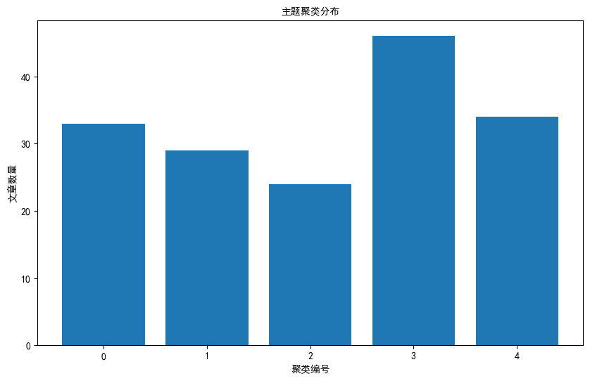

# 过去两周计算机与社会 arXiv 文章
（2025年03月11日）
**文章总数**: 166篇  
**推荐阈值**: 0.00分以上  

## 发文趋势分析

## 主题分析

### 推荐论文 1: （Securing External Deeper-than-black-box GPAI Evaluations）
**评分**: 0.50  
**作者**: Alejandro Tlaie, Jimmy Farrell  

**摘要**:  
本文探讨了进行通用人工智能（GPAI）模型的安全有效外部评估所面临的关键挑战和潜在解决方案。随着这些模型规模、能力、影响力和相关风险的指数级增长，确保问责制、安全性和公众信任需要超越传统黑匣子方法的框架。讨论从分析对更深入的黑匣子评估的需求开始（第一部分），强调了理解模型内部以揭示潜在风险并确保符合道德和监管标准的重要性。在此基础上，第二部分讨论了远程评估的安全考虑，概述了威胁格局、技术解决方案和必要的保障措施，以保护评估者和专有模型数据。最后，第三部分将这些见解综合为可操作的建议和未来方向，旨在建立一个健壮、可扩展和透明的GPAI治理外部评估框架。

---

### 推荐论文 2: （Sometimes the Model doth Preach: Quantifying Religious Bias in Open LLMs through Demographic Analysis in Asian Nations）
**评分**: 0.46  
**作者**: Hari Shankar, Vedanta S P, Tejas Cavale, Ponnurangam Kumaraguru, Abhijnan Chakraborty  

**摘要**:  
大型语言模型（LLMs）能够生成意见并在不知情的情况下传播偏见，这些偏见源自不具代表性和缺乏多样性的数据收集。先前的研究已经分析了这些意见与西方，特别是美国的关系。然而，由此产生的见解可能无法推广到非西方人口。随着大量用户跨越不同生活领域使用LLM系统，每个生成输出的文化敏感性至关重要。我们的工作提出了一种新颖的方法，定量分析LLMs生成的意见，改进了以往关于提取模型社会人口统计信息的工作。我们的方法通过汉明距离测量LLM的响应与调查受访者之间的距离，以推断模型输出中反映的人口统计特征。我们评估现代、开放的LLMs，如Llama和Mistral，在各个全球南方国家进行的调查中的表现，重点关注印度和其他亚洲国家，特别评估模型在与宗教宽容和身份相关的调查上的表现。我们的分析显示，大多数开放的LLMs匹配一个单一的同质化配置文件，在不同国家/地区之间变化，这反过来引发了关于LLMs促进霸权世界观和削弱不同少数群体观点的风险的问题。我们的框架也可能对未来研究有用，探讨训练数据、模型架构以及LLM输出中反映的偏见之间复杂交叉的问题，特别是涉及宗教宽容和身份等敏感话题。

---

### 推荐论文 3: （Creating and Evaluating Privacy and Security Micro-Lessons for
  Elementary School Children）
**评分**: 0.44  
**作者**: Lan Gao, Elana B Blinder, Abigail Barnes, Kevin Song, Tamara Clegg, Jessica Vitak, Marshini Chetty  

**摘要**:  
K-8教室中技术的日益普及突显了一个平行需求，即提供正式学习机会，帮助孩子们安全地使用技术并保护他们的个人信息。即使是最年幼的学生现在也在使用平板电脑、笔记本电脑和应用程序来支持他们的学习；然而，在数字隐私和安全主题上，对于小学和初中生的课程材料有限。为了弥补这一差距，我们开发了一系列微课，帮助K-8年级的孩子们在学校学习有关数字隐私和安全的知识。我们首先通过采访小学教师进行了一个形成性研究，以确定数字隐私和安全课程的设计需求。然后，我们使用多轮共同设计的方法，与教师合作开发和修订微课——多个15-20分钟的活动，旨在轻松地融入现有课程中。在整个过程中，我们进行了评估会议，教师实施或审查了微课。我们的研究确定了在K-8数字隐私和安全主题中引入微课时的优势、挑战和教师的调整策略，为促进学生在学校课堂上学习这些主题提供了设计启示。

---

### 推荐论文 4: （Artificial Utopia: Simulation and Intelligent Agents for a Democratised Future）
**评分**: 0.00  
**作者**: Yannick Oswald  

**摘要**:  
传统的自上而下的政治和经济体系在与21世纪的紧迫挑战，如气候变化、社会不平等和冲突等问题的竞争中难以跟上步伐。越来越多人认为，在政治和经济领域，自下而上的民主化和参与式方法被视为应对和克服这些问题的有希望的替代方案，通常带有乌托邦色彩，支持者认为这些方法可能会显著重塑政治、社会和生态未来，与当今各国的权威主义倾向形成对比。然而，对于制度具体细节及相关的集体人类行为或文化仍知之甚少且鲜有讨论。在本文中，我提出了一个关于乌托邦民主化努力的新型研究议程，重点是采用形式化和计算方法以及人工智能——我将这一议程称为“人工乌托邦”。人工乌托邦为新政治思想和经济政策提供了安全的测试场所，通过在模拟环境中测试这些想法，相比在现实世界中测试，可以减少负面后果的风险。越来越多的先进模拟和智能方法，旨在更真实地代表人类认知和集体决策方式，可以受益于这一过程。这包括基于代理的建模、强化学习、大型语言模型等。我通过两个制度示例——公民议会和民主公司，阐明了一些这些模拟方法如何有助于研究人工乌托邦。

---

### 推荐论文 5: AI Biases as Asymmetries: A Review to Guide Practice
**评分**: 0.00  
**作者**: Gabriella Waters, Phillip Honenberger  

**摘要**:  
目前，对人工智能中偏见的理解正在经历一场革命。最初被理解为错误或缺陷，偏见越来越被认为是人工智能系统的一部分，并有时被认为是比较不偏见的替代方案更可取。在本文中，我们回顾了这种变化理解的原因，并就两个问题提供了新的指导：首先，我们应该如何思考和衡量人工智能系统中的偏见，以符合这种新理解？其次，人工智能系统中的哪种偏见应该被接受甚至被放大，哪种应该被最小化或消除，以及为什么？我们认为，回答这两个问题的关键是将偏见理解为“对称标准的违反”（遵循Kelly的观点）。我们区分了人工智能系统中的三种主要不对称类型——错误偏见、不平等偏见和过程偏见，并强调了在人工智能开发和应用过程中可能会出现每种类型偏见的好处、坏处或不可避免的地方。

---

### 推荐论文 6: （Creating Cybersecurity Regulatory Mechanisms, as Seen Through EU and US Law）
**评分**: 0.00  
**作者**: Kaspar Rosager Ludvigsen  

**摘要**:  
由于数字设备和系统在社会的各个方面被广泛使用，对手创建同等级别的网络攻击的风险仍然很高。因此，必须对这些方面进行监管，这是网络安全的领域。由于这个话题是全球性的，不同的司法管辖区应该从其他地方成功的技术中汲取灵感，欧盟和美国是最有经验和历史悠久的。从它们各自的方法中可以得出什么，以供其他民主司法管辖区使用，当我们以这种务实的方法进行比较时会发生什么？令人奇怪的是，全球大多数司法管辖区对网络安全有相当深入的了解。然而，概念的理解不能强制执行或创造遵从，因此需要良好的监管方法。对欧盟和美国的比较法律分析表明，在定义和执法方面存在很大差异，但在两个司法管辖区中一些概念是重复的。这些概念可以进一步完善，成为可推导的原则，可以用来启发任何民主司法管辖区的立法。它们是：自愿合作、可调整的定义、强有力的权威、强制性的计算机应急响应团队和有效的制裁。这5个原则并不是穷尽的，但结合了这两个司法管辖区的经典监管和实践经验。

---

### 推荐论文 7: （An Analytics-Driven Approach to Enhancing Supply Chain Visibility with Graph Neural Networks and Federated Learning）

Supply chain visibility is crucial for businesses to optimize their operations and make informed decisions. In this paper, an analytics-driven approach is proposed to enhance supply chain visibility using Graph Neural Networks (GNN) and Federated Learning. GNNs are powerful tools for modeling complex relationships and dependencies in supply chain networks, allowing for better prediction and optimization. Federated Learning enables multiple parties to collaboratively train a shared model without sharing sensitive data, making it ideal for supply chain applications where data privacy is a concern. By combining GNNs and Federated Learning, this approach offers a promising solution to improve supply chain visibility and efficiency.
**评分**: 0.00  
**作者**: Ge Zheng, Alexandra Brintrup  

**摘要**:  
在当今全球化贸易中，供应链形成了跨越多个组织甚至多个国家的复杂网络，使其极易受到干扰。最近全球危机凸显的这些脆弱性强调了对供应链可见性和弹性的迫切需求。然而，由于隐私、安全和监管方面的考虑，数据共享限制通常阻碍了组织或国家之间实现全面可见性的目标。此外，大多数现有研究主要关注个别公司或产品级别的网络，忽视了真实供应链中多样实体之间的多方面互动，从而限制了对供应链动态的整体理解。为了解决这些挑战，我们提出了一种新颖的方法，该方法将联邦学习（Federated Learning，FL）和图卷积神经网络（Graph Convolutional Neural Networks，GCNs）相结合，通过在供应链知识图中进行关系预测来增强供应链可见性。FL通过促进信息共享而无需原始数据交换，实现了跨国家的协作模型训练，确保符合隐私法规并保持数据安全。GCNs使该框架能够捕捉知识图中复杂的关系模式，实现准确的链接预测，揭示隐藏的连接并为供应链网络提供全面洞察。实验结果验证了所提方法的有效性，展示了其在准确预测国家级供应链知识图中的关系方面的能力。这种增强的可见性支持可操作的洞察力，促进积极的风险管理，并有助于制定具有弹性和适应性的供应链战略，确保供应链更好地应对全球经济的复杂性。

---

### 推荐论文 8: （ACAI for SBOs: AI Co-creation for Advertising and Inspiration for Small Business Owners）
**评分**: 0.00  
**作者**: Nimisha Karnatak, Adrien Baranes, Rob Marchant, Triona Butler, Kristen Olson  

**摘要**:  
小型企业所有者（SBOs）通常缺乏生产高质量广告所需的资源和设计经验。为了解决这一问题，我们开发了ACAI（AI合作广告和灵感生成），这是一个由GenAI驱动的多模式广告创作工具，并与伦敦的16名SBOs进行了用户研究，以探索他们对ACAI在广告创作中的感知和互动。我们的研究结果表明，结构化输入提高了用户的主动性和控制能力，同时通过促进更好的品牌对齐、增强AI透明度以及提供辅助新手设计者（如SBOs）制定提示的支架，从而改善了AI的输出。我们还发现，ACAI的多模式界面弥合了对于具有明确广告愿景但缺乏有效提示所需的设计术语的SBOs来说的设计技能差距。基于我们的发现，我们提出了三种能力：上下文智能、自适应互动和数据管理，并提出相应的设计建议，以推进AI中介设计工具的共创属性。

---

### 推荐论文 9: Introduction

The Turing Test, proposed by Alan Turing in 1950, is a test of a machine's ability to exhibit intelligent behavior indistinguishable from that of a human. Over the years, various iterations of the test have been conducted to evaluate the progress of artificial intelligence (AI) systems. In this critical analysis, we will examine the potential of ChatGPT-4, the latest version of OpenAI's conversational AI model, in passing the Turing Test.

ChatGPT-4 Overview

ChatGPT-4 is a state-of-the-art language model that builds on the success of its predecessors, such as GPT-3, by incorporating advanced natural language processing (NLP) techniques. It is designed to generate human-like responses in conversational settings, making it a strong candidate for the Turing Test.

Strengths of ChatGPT-4 in the Turing Test

1. Language Understanding: ChatGPT-4 demonstrates a high level of language understanding, allowing it to engage in meaningful conversations on a wide range of topics. Its ability to generate contextually relevant responses contributes to its potential to pass as a human in a text-based interaction.

2. Contextual Awareness: The model excels in maintaining context across multiple turns in a conversation, enabling it to provide coherent and relevant responses. This contextual awareness is crucial for passing the Turing Test, as it simulates human-like conversational flow.

3. Knowledge Base: ChatGPT-4 has access to a vast amount of information, allowing it to provide accurate and informative answers to a variety of questions. Its ability to retrieve and synthesize knowledge from diverse sources enhances its credibility in the Turing Test.

Challenges for ChatGPT-4 in the Turing Test

1. Lack of Emotional Intelligence: While ChatGPT-4 can generate contextually appropriate responses, it may struggle to convey emotions effectively. Emotionally intelligent responses are an important aspect of human communication, and the model's limitations in this area could be a barrier to passing the Turing Test convincingly.

2. Originality and Creativity: Generating truly original and creative responses remains a challenge for ChatGPT-4. While it can produce coherent and relevant text, the model may struggle to go beyond existing patterns and clichés, which could be a limitation in the Turing Test where creativity is valued.

Conclusion

In conclusion, ChatGPT-4 demonstrates significant strengths in language understanding, contextual awareness, and knowledge base, positioning it as a strong contender for passing the Turing Test. However, challenges related to emotional intelligence, originality, and creativity highlight areas where further advancements are needed to enhance the model's human-like conversational abilities. As AI continues to evolve, the potential of ChatGPT-4 in the Turing Test underscores the ongoing progress in developing AI systems capable of engaging in sophisticated human-like interactions.
**评分**: 0.00  
**作者**: Marco Giunti  

**摘要**:  
本文对Restrepo Echavarría（2025年）最近发表的论文《ChatGPT-4在图灵测试中的应用》进行了批判性分析，挑战了其关于缺乏最小程度严肃测试实现和ChatGPT-4未通过图灵测试的核心观点。分析揭示了基于严格标准和有限实验数据的批评并不完全合理。更重要的是，本文提出了几点建设性的贡献，丰富了我们对图灵测试实现的理解。它表明两种不同的格式--三人和二人测试--都是有效的，各自具有独特的方法论含义。该工作区分了绝对标准（反映在三人格式中的最佳50%识别率）和相对标准（衡量机器表现如何接近人类的标准），提供了更加细致的评估框架。此外，本文通过将其建模为伯努利实验，澄清了两种测试类型的概率基础--在三人版本中是相关的，在二人版本中是不相关的。这种形式化使得能够严格区分通过测试的理论标准（以概率术语定义）和需要强大统计方法进行正确解释的实验数据。通过这样做，本文不仅驳斥了被批评研究的关键方面，还为未来关于评估AI行为与人类行为的接近程度或偏离程度的客观度量的研究奠定了坚实基础。

---

### 推荐论文 10: （From Motion Signals to Insights: A Unified Framework for Student Behavior Analysis and Feedback in Physical Education Classes）
**评分**: 0.00  
**作者**: Xian Gao, Jiacheng Ruan, Jingsheng Gao, Mingye Xie, Zongyun Zhang, Ting Liu, Yuzhuo Fu  

**摘要**:  
在教育场景中分析学生行为对于提高教学质量和学生参与至关重要。现有基于人工智能的模型通常依赖课堂视频素材来识别和分析学生行为。虽然这些基于视频的方法可以部分捕捉和分析学生的行为，但在体育课等在户外、开放空间进行的课程中，往往难以准确追踪每个学生的行为，因为这些课程涉及多样的活动，并且很难推广到这些环境中涉及的专门技术动作。此外，当前方法通常缺乏整合专业教学知识的能力，限制了它们提供深入洞察学生行为并为优化教学设计提供反馈的能力。为了解决这些限制，我们提出了一个统一的端到端框架，利用基于动作信号的人类活动识别技术，结合先进的大型语言模型，对体育课中学生行为进行更详细的分析和反馈。我们的框架从教师的教学设计和学生在体育课程中的动作信号开始，最终生成带有教学见解和改进建议的自动化报告，以优化学习和课堂教学。这个解决方案提供了一种基于动作信号的方法来分析学生行为，并优化适用于体育课程的教学设计。实验结果表明，我们的框架能够准确识别学生行为并产生有意义的教学见解。

---
